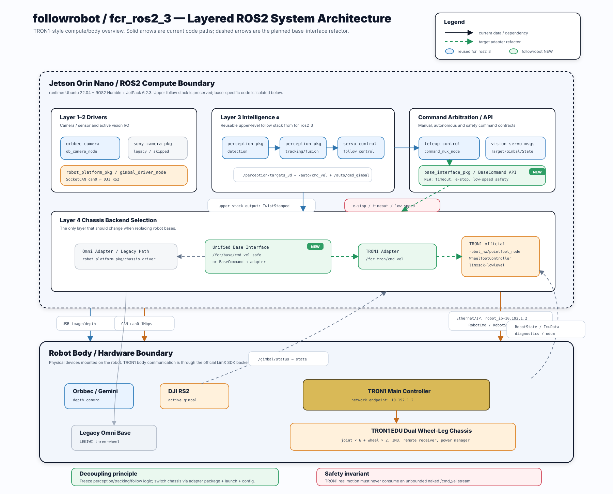

# FCR ROS2 Visual Servoing Workspace (fcr_ros2_3)

基于 ROS2 Humble 的智能跟拍机器人项目。LEKIWI 三轮全向底盘 + DJI RS2 云台相机 + YOLO 目标检测 + IBVS/PBVS 视觉伺服。

---

## 当前交接入口

如果你正在从一个新的 Codex 会话或一台新机器接手，请先读：

- [`docs/HANDOFF.md`](docs/HANDOFF.md)：完整工程现场说明书，包含硬件连接、网络/SSH、RS2/Orbbec/TRON1 状态、已踩坑和下一步。
- [`docs/CODEX_HANDOFF_PROMPT.md`](docs/CODEX_HANDOFF_PROMPT.md)：可直接复制给新 Codex 的启动 Prompt。

当前活跃 GitHub 仓库是：<https://github.com/Miya555orz/followrobot>。上游学长原仓库仍保留为 `origin=https://github.com/cuiangA/fcr_ros2_3.git`，迁移工作默认推送到 `followrobot/main`。

---

## TRON1 EDU 迁移状态（当前接手重点）

本项目正在从原 LEKIWI 三全向轮底盘迁移到逐际动力 TRON1 EDU 双轮足底盘。当前 TRON1 仿真使用 `WF_TRON1A`，第一次实机计划硬件为 TRON1 EDU + DJI RS2 云台 + Orbbec Gemini 335 深度相机 + Jetson Orin Nano；Sony 相机链路单独处理，不能作为 TRON1 安全迁移的前置阻塞项。

### 当前所在步骤（2026-09-03）

当前已完成一次 TRON1 真机通信/遥控器/controller 激活观察，但不继续实机运动。项目处在：

```text
TRON1 遥控器熟悉 + Gazebo 仿真优先阶段
```

已完成：

- Jetson Orin Nano CLB 已刷入 JetPack 6.2.3 / Jetson Linux R36.5.2，并从 NVMe 启动。
- Jetson 上 ROS 2 Humble 可用，`ros2 topic list` 正常返回 `/parameter_events` 和 `/rosout`。
- Jetson 工作区 `~/follow_ws` 中已能识别核心包：`vision_servo_msgs`、`robot_platform_pkg`、`teleop_control_pkg`。
- Jetson 板载 CAN `can0` 已确认存在，驱动为 `mttcan`；但 CLB 板载 CAN 需要走金手指连接，当前 RS2 实测改用 USB-CAN。
- RS2 当前实测链路：`/cmd_gimbal -> gimbal_driver_node -> SocketCAN can1 -> USB-CAN gs_usb -> DJI RS2`。
- RS2 over USB-CAN `can1` 已完成通信和极小角度 yaw 测试：`/gimbal/status connected=true`，CAN/CRC/parse error 均为 0。
- Orbbec Gemini 335 已在 Jetson USB3.2 下跑通低负载深度流：`/camera/depth/image_raw` 424x240@10Hz，`/camera/depth/camera_info` 正常。
- RS2 + Orbbec 深度相机共存测试已通过。
- Sony ZV-E10M2 已通过 UVC 模式枚举为 `/dev/video8`，新增轻量 UVC publisher 可发布 `/sony/image_raw` 与 `/sony/camera_info`；YOLOv8n CPU detection/tracking/aim smoke test 已识别到画面中的 `person`。
- Sony UVC 人像识别 + DJI RS2 保守中速闭环跟随已在 Jetson 实机跑通：`/sony/image_raw -> /perception/debug_image -> /perception/aim_target_2d -> gimbal_visual_servo_node -> /auto/cmd_gimbal -> command_mux -> /cmd_gimbal -> gimbal_driver_node -> can1 -> RS2`。现场确认方向正常后，`gimbal_visual_servo_low_speed_lab.yaml` 最终调到 yaw `0.12 rad/s`、pitch `0.075 rad/s` 上限；仍显著低于正常档 `0.35 rad/s`。
- Jetson 轻量网页预览已可用：`tools/visualization/ros_image_mjpeg_viewer.py` 可在电脑浏览器打开 `http://<JETSON_IP>:8088/` 同时查看 Sony 原始图和 OpenCV debug 图。
- Sony CRSDK 版 `sony_camera_node` 仍未启用：需要将 Sony CRSDK staged 到 `src/sony_camera_pkg/sdk` 后才能构建。
- TRON1 安全限速链路已准备，默认 `enable_motion=false`，首次实机速度限制为 `0.03 m/s`、`0.10 rad/s`。
- PC 到 TRON1 默认 IP `10.192.1.2` 的 Ethernet 链路已验证可通。
- 官方 `pointfoot_node` 已验证能连接 TRON1、加载 `WF_TRON1A` / `isaacgym` ONNX，并订阅安全话题 `/fcr_tron/cmd_vel`。
- 遥控器 axes/buttons 已通过 LimX SDK `SensorJoy` 读到；`L1 + 三角/Y` 会启动 `WheelfootController`。
- 物理 motor switch / hardware action 已观察到 `Motor in damping mode`，官方节点随后停止 controller 并退出。
- 重要修正：`L1 + X` 只是软件 `stopController()` + `abort()`，不是泄力/阻尼。

下一步：

1. 暂停 TRON1 真机运动；先在 Gazebo 中熟悉 controller 启动、stop、timeout、limiter 输出和漂移行为。
2. 不让旧 FCR `/cmd_vel` 直连 TRON1；TRON1 只走 `/fcr_tron/cmd_vel` 安全链。
3. 下一次实机前必须先完成遥控器 stop/物理 damping/安全空间 checklist。
4. Sony 后续继续优化 USB3 接口、正式 CRSDK 节点和完整跟拍闭环。

迁移说明、启动命令、安全限速测试和第一次实机 checklist 见：

- [docs/tron1_migration.md](docs/tron1_migration.md)
- [docs/tron1_jetson_comm_bringup.md](docs/tron1_jetson_comm_bringup.md)
- [docs/tron1_sim_test_framework.md](docs/tron1_sim_test_framework.md)
- [docs/tron1_external_repo_note.md](docs/tron1_external_repo_note.md)
- [docs/TRON1_REMOTE_AND_SIM_SAFETY.md](docs/TRON1_REMOTE_AND_SIM_SAFETY.md)
- [docs/jetson_rs2_bringup_log.md](docs/jetson_rs2_bringup_log.md)
- [docs/jetson_orin_nano_clb_setup.md](docs/jetson_orin_nano_clb_setup.md)
- [docs/jetson_rs2_depth_test_plan_2026-09-02.md](docs/jetson_rs2_depth_test_plan_2026-09-02.md)

当前安全链路：

```text
FCR /fcr/cmd_vel_stamped (TwistStamped)
  → robot_platform_pkg/tron1_safety_limiter_node
  → /fcr_tron/cmd_vel (Twist)
  → TRON1 官方 controller
```

模块级进度：

```text
基础工程 / 代码仓库
  GitHub fork / 推送链路        ██████████ 100%  followrobot/main 已确认
  关键 handoff 文档             ██████████ 100%  README / HANDOFF / CODEX prompt 已更新
  OpenCode 使用与安全规则        █████████░  90%  配置/指南完成，Harness 写入流未完全实战
  本地 ROS2 包编译               ██████████ 100%  robot_platform / teleop / bringup focused build 通过

Jetson 平台
  Jetson 刷机 / NVMe 启动        ██████████ 100%  JetPack 6.2.3 / R36.5.2
  Jetson ROS2 Humble             ██████████ 100%  基础 topic / 核心包可见
  PC <-> Jetson SSH              █████████░  90%  以太网 SSH 已通，需避开 Mihomo/USB gadget 坑
  Jetson <-> TRON Ethernet       ███░░░░░░░  30%  PC 侧已通，Jetson 侧未实测

DJI RS2 云台链路
  USB-CAN can1 / gs_usb          ██████████ 100%  can1 ERROR-ACTIVE，错误计数正常
  RS2 ROS2 driver                ██████████ 100%  /gimbal/status connected=true
  RS2 小角度手动控制             ██████████ 100%  yaw 方向与微动验证完成
  RS2 视觉伺服跟拍               █████████░  90%  Sony UVC + 人像 + RS2 闭环已实测

相机 / 感知
  Orbbec Gemini 335 深度流       ██████████ 100%  424x240@10Hz 已验证
  RS2 + Orbbec 共存              ██████████ 100%  已验证
  Sony UVC 图像链路              █████████░  90%  /dev/video8 -> /sony/image_raw 已跑通
  YOLO / tracking / aim smoke    ████████░░  80%  person / track / aim_target_2d 已验证
  Sony CRSDK 正式链路            ██░░░░░░░░  20%  CRSDK 不在仓库，节点未启用

TRON1 官方 SDK / 控制器
  官方仓库 / launch / config 理解 █████████░  90%  入口、topic、env、ONNX 路径已查清
  WF_TRON1A + isaacgym 模型       █████████░  90%  policy / encoder 可加载
  官方 cmd_vel topic override     ████████░░  80%  本地补丁存在，需长期整理到外部 repo
  controller watchdog             ███████░░░  70%  超时清零意图已补，零命令漂移仍待解

TRON1 仿真
  Gazebo / official sim launch    ████████░░  80%  可启动，rqt steering 默认关闭
  /fcr_tron/cmd_vel 控制链        ███████░░░  70%  能驱动/能归零，需继续熟悉 stop 行为
  基础运动复现                    ██████░░░░  60%  forward/stop/back/turn 已跑过，漂移需复核
  仿真安全验收                    █████░░░░░  50%  limiter PASS，controller/hard-stop 仍需理解

TRON1 真机
  PC <-> TRON Ethernet            ██████████ 100%  10.192.1.2 经 enp0s31f6 ping 通
  PC -> TRON SDK 连接             █████████░  90%  pointfoot_node 已连接并加载 ONNX
  遥控器 axes/buttons             ██████████ 100%  SensorJoy 已读到摇杆和按键
  controller 激活                 ███████░░░  70%  L1 + 三角/Y 可启动 WheelfootController
  物理 damping / hardware stop    ████████░░  80%  Motor in damping mode 已观察
  L1 + X 软件 stop                ████░░░░░░  40%  代码存在，但不是泄力，实测体验未验收
  真机低速运动验收                ███░░░░░░░  30%  能激活但太猛，已暂停

安全链路
  FCR limiter clamp               █████████░  90%  限速输出已验证
  input timeout -> zero           █████████░  90%  topic 输出层已验证
  shutdown zero burst             █████████░  90%  SIGINT/SIGTERM 尾包为 0
  kill/crash 兜底                 █████░░░░░  50%  需依赖 controller watchdog / 硬件 stop
  裸 /cmd_vel 隔离                ████████░░  80%  FCR 链路已隔离，官方 joystick publisher 仍需注意

集成目标
  Jetson 控 TRON                  █████░░░░░  50%  架构 ready；Jetson 实网 + 仿真安全 + 低速验收未完
  Jetson 控云台跟拍               █████████░  90%  已实测，可继续优化
  RS2 + Camera + TRON 协同        ████░░░░░░  40%  底盘应只做慢速 yaw/距离补偿，未联调
  Full Person Following           ███░░░░░░░  30%  视觉和云台 ready，TRON 真机安全未过
```

距离目标的工程判断：

- Jetson 控 TRON：还差 Jetson <-> TRON Ethernet 实网、Jetson 侧 `/fcr_tron/cmd_vel` 图检查、仿真 stop/timeout 复核、实机极低速脉冲验收。架构已经接近，安全验收还没到。
- Jetson 控云台跟拍：已经很近，Sony UVC + RS2 over `can1` 跟拍已实测；CRSDK 是后续增强项，不阻塞 UVC 版跟拍。
- Jetson 控云台跟拍 + TRON：还不能直接上真机。先在 Gazebo 中把 TRON controller/stop/damping/timeout 行为摸清楚，再让底盘只做低速长期 yaw/距离补偿，避免云台和底盘抢同一个误差。

安全提醒：不要让 TRON1 直接订阅旧 FCR `/cmd_vel`；下一次实机必须先经过 `tron1_safety_limiter`，并使用极低速度（建议先 `0.01 m/s`、`0.03 rad/s`）、超时停车和物理 damping/急停准备。

### ROS2 System Architecture Figure

下图基于当前 `fcr_ros2_3` / `followrobot` 代码和本地 TRON1 官方 ROS2/SDK 工作区整理，重点展示从传感器、感知、跟随控制、命令仲裁、底盘接口到 TRON1 SDK/硬件的真实数据流，以及后续“换底盘 = 换 adapter package / launch / config”的目标架构。



- 实线表示当前代码已经存在的数据流或依赖。
- 虚线表示计划新增或重构后的底盘解耦路径。
- 灰色模块表示准备逐步弱化的 legacy 三全向轮底盘链路。
- 蓝色模块表示保留/复用的上层视觉、跟踪和跟随控制栈。
- 绿色模块表示 `followrobot` 迁移中新增或计划抽出的接口/适配层。
- 橙色模块表示 RS2 硬件链路与 TRON1 官方 ROS2/SDK 链路。

---

## 新 Jetson / 新机器复现说明

GitHub 仓库保存的是源码、launch、config、脚本、文档和必要的第三方可再分发 SDK 文件；不保存 `build/`、`install/`、`log/` 这些本机生成物。换一台 Jetson 时应重新安装系统依赖并本地编译。

基础恢复流程：

```bash
cd ~/follow_ws/src/fcr_ros2_3

# 正常网络可直接运行；如果 Jetson apt 被校园网认证页劫持，可先通过 SSH 反向代理提供 APT_PROXY。
bash tools/tron1_bringup/install_jetson_camera_deps.sh

cd ~/follow_ws
source /opt/ros/humble/setup.bash
MAKEFLAGS="-j1 -l1" colcon build --symlink-install --parallel-workers 1 \
  --packages-up-to orbbec_camera sony_camera_pkg
source ~/follow_ws/install/setup.bash
```

RS2 USB-CAN 启动：

```bash
cd ~/follow_ws/src/fcr_ros2_3
bash tools/can/setup_gimbal_can.sh

cd ~/follow_ws
source /opt/ros/humble/setup.bash
source ~/follow_ws/install/setup.bash
ros2 launch robot_platform_pkg gimbal_bringup.launch.py \
  use_sim:=false \
  can_interface:=can1 \
  control_mode:=incremental_position
```

Orbbec 低负载深度相机启动：

```bash
source /opt/ros/humble/setup.bash
source ~/follow_ws/install/setup.bash
ros2 launch orbbec_camera gemini_330_series_low_cpu.launch.py \
  camera_name:=camera \
  enable_color:=false \
  enable_depth:=true \
  depth_width:=424 \
  depth_height:=240 \
  depth_fps:=10 \
  enable_left_ir:=false \
  enable_right_ir:=false \
  enable_point_cloud:=false \
  enable_accel:=false \
  enable_gyro:=false
```

Sony 注意事项：

- `src/sony_camera_pkg/sdk/` 被 `.gitignore` 排除，因为 Sony Camera Remote SDK 是专有 SDK，不能直接随仓库发布。
- 新机器若要构建 `sony_camera_node`，需要先按 `src/sony_camera_pkg/scripts/install_crsdk.py` 的说明把 Sony CRSDK 放入本地 `src/sony_camera_pkg/sdk/`。
- 如果 `lsusb` 看不到 Sony，先排查相机 USB 模式、线材和是否接在支持数据/高速的 USB 口上。

---

## 项目当前阶段

按照[四阶段渐进路线](https://github.com/cuiangA/fcr_ros2_3)（V1 MVP → V2 稳定化 → V3 混合视觉伺服 → V4 MPC优化），**当前处于 V2.5**：

```
V1  MVP          ████████████████████░  90%  控制闭环与感知代码完整，待相机标定实测
V2  稳定化       █████████████████░░░░  85%  滤波/死区/限幅/目标管理齐全
V3  混合视觉伺服  ██████████████░░░░░░░  70%  IBVS/PBVS/Allocator/热切换已实现
V4  MPC/优化      █░░░░░░░░░░░░░░░░░░░░   5%  仅头文件骨架
```

| 阶段 | 控制方案 | 状态 |
|------|---------|------|
| V1 | 图像误差控制 + 距离控制 + 云台偏角补偿 | ✅ 基本完成（待双相机实测） |
| V2 | V1 + 滤波 + 死区 + 限幅 + 目标锁定 | ✅ 大部分完成 |
| V3 | 云台 IBVS + 底盘 PBVS + 控制分配 | ✅ 算法完成，架构待拆分 |
| V4 | QP / MPC 协同控制 | ❌ 未开始 |

---

## 1. 包结构

```
fcr_ros2_3/
├── build.sh
├── src/
│   ├── vision_servo_msgs/       # 接口定义包（5 msg, 3 srv, 1 action）
│   ├── perception_pkg/          # 感知管线（Sony 检测→目标跟踪）
│   ├── servo_control_pkg/       # 伺服控制（IBVS/PBVS/MPC/RL + MVP跟拍）
│   ├── robot_platform_pkg/      # 硬件平台（底盘/云台/IMU/里程计）
│   ├── simulation_pkg/          # 仿真（Gazebo URDF + Python脚本）
│   └── bringup_pkg/             # 一键启动（launch/config/rviz）
```

---

## 2. 数据流

```
/sony/image_raw  ──→  DetectionNode(YOLO ONNX/TensorRT) ──→ /perception/detections
                                                          │
                                                          ▼
                                                   TrackingNode(SORT)
                                                   /perception/tracks
                                                          │
                                                          ▼
                                                   /perception/tracks
                                                          │（深度融合后续实现）
/platform/state  ←──  PlatformManagerNode  ←──  ServoManagerNode
                                                         │
                                              ┌──────────┼──────────┐
                                              ▼                     ▼
                                         /cmd_vel              /cmd_gimbal
                                      (TwistStamped)          (GimbalCmd)
                                              │                     │
                                              ▼                     ▼
                                        ChassisDriver         GimbalDriver
```

### 轻量替代路径（MVP 跟拍）

```
mock_target_publisher / simple_robot_sim
        ↓
/target/current
        ↓
mvp_follow_controller_node    ← 自包含，不依赖 pluginlib / ControlAllocator
        ↓
/cmd_vel + /cmd_gimbal
```

---

## 3. 各模块实现状态

### 3.1 perception_pkg — 感知管线

| 模块 | 状态 | 说明 |
|------|------|------|
| YOLO 检测 (DetectionNode) | 🚧 待Jetson验收 | YOLOv5/v8 ONNX/TensorRT、可测前后处理、NMS、后台最新帧推理和诊断 |
| 多目标跟踪 (MultiObjectTracker) | 🚧 待Jetson验收 | 8 状态 Kalman `[x,y,w,h,vx,vy,vw,vh]` + 时间尺度预测 + Hungarian全局IoU关联 |
| 深度估计 (DepthEstimatorNode) | ⚠️ 历史兼容 | 保留原仿真代码，不进入当前默认启动链 |
| 双相机融合 | ⏳ 后续阶段 | 本轮不实现；待相机驱动、安装方式和标定方案确定后单独设计 |

**跟踪器核心逻辑** ([multi_object_tracker.cpp](src/perception_pkg/src/multi_object_tracker.cpp))：

```
每帧：predict() → associate(IoU + Hungarian) → Kalman correct() → 创建新轨迹 / 删除超龄轨迹
仅在连续命中达到 min_hits(3) 后确认；短时丢失轨迹标记 LOST/visible=false
```

**当前感知主链路**：

```
Sony Image → YOLO ONNX → /perception/detections
→ Kalman + IoU tracking → /perception/tracks
```

### 3.2 servo_control_pkg — 伺服控制

| 模块 | 状态 | 说明 |
|------|------|------|
| IBVS 控制器 | ✅ 完成 | 6x6 交互矩阵，SVD 阻尼伪逆，自适应增益 |
| PBVS 控制器 | ✅ 完成 | 平移 + 旋转解耦（光轴叉积） |
| ControlAllocator | ✅ 完成 | 优先级分配：云台优先旋转，底盘负责平移+剩余旋转 |
| ServoManagerNode | ✅ 完成 | 50Hz 控制循环，pluginlib 加载，VisualServo Action，SetServoMode 服务 |
| MvpFollowControllerNode | ✅ 完成 | 三通道解耦 P 控制 + 单点 IBVS 模式，两级滤波，死区 |
| MPC 控制器 | ❌ 占位 | 仅有头文件，QP 求解器接口预留 |
| RL 控制器 | ❌ 占位 | 仅有头文件，ONNX 推理接口预留 |

**MVP 跟拍控制架构** ([mvp_follow_controller_node.cpp](src/servo_control_pkg/src/mvp_follow_controller_node.cpp))：

```
内环（云台，高带宽）：ex,ey → P 或 2x3 角速度 IBVS → gimbal_yaw/pitch
外环（底盘，低带宽）：ez = Z - Z_desired → base_vx
                      q_yaw（云台偏角）→ base_wz   ← 串级：底盘不直接追 ex
信号链：raw → LP(α=0.5) → deadband → P gain → LP(α=0.3) → clamp → output
```

**控制律**：

```
gimbal_yaw   = -Kx · e_x          (e_x = (cx - W/2) / (W/2))
gimbal_pitch = -Ky · e_y
base_vx      =  Kz · e_z          (e_z = Z - Z_desired)
base_wz      =  Kb · q_yaw        (追云台偏角，不追图像误差)
```

### 3.3 robot_platform_pkg — 硬件平台

| 模块 | 状态 | 说明 |
|------|------|------|
| 三轮全向运动学 | ✅ 完成 | 120° 对称布局，正/逆运动学矩阵预计算 |
| 底盘驱动 (LEKIWI) | ⚠️ 仿真完成 | 真实串口通信为 TODO |
| 云台驱动 (DJI RS2) | 🚧 Jetson 实机验收中 | SocketCAN + DJI R SDK 协议实现已在代码中；今天重点验证 Jetson `can0` 到 RS2 |
| IMU 驱动 (BNO055) | ⚠️ 仿真完成 | 真实 I2C 通信为 TODO |
| 里程计 | ✅ 完成 | 轮式里程计 + IMU 融合 |
| PlatformManager | ✅ 完成 | 聚合底盘/云台/IMU 状态为 PlatformState |

全部使用 Factory Pattern：`use_sim` 参数切换真实/模拟实现，上层算法节点不感知硬件模式。

### 3.4 simulation_pkg — 仿真

| 模块 | 状态 | 说明 |
|------|------|------|
| URDF/XACRO 机器人模型 | ✅ 完成 | 底盘 + 云台 + 深度相机 + IMU，模块化组合 |
| Gazebo 世界 | ✅ 完成 | 含目标物 |
| target_simulator.py | ✅ 完成 | 圆形/8字形/直线轨迹，支持 TF 变换链 |
| mock_target_publisher.py | ✅ 完成 | 合成 TargetArray（center/left/right/up/down/far/near/lost/sinusoidal） |
| simple_robot_sim_node.py | ✅ 完成 | 轻量 2D 闭环仿真（不依赖 Gazebo），用于 MVP 测试 |
| camera_simulator.py | ✅ 完成 | 发布 camera_info（TRANSIENT_LOCAL QoS） |

---

## 4. 接口定义

### Messages（5个）

| Message | 关键字段 |
|---------|---------|
| `Target` | id, class_name, bbox[4], center[2], confidence, position[3], velocity[3], depth_confidence |
| `TargetArray` | Header, Target[] targets, int32 tracking_id |
| `ServoState` | state (IDLE/CONVERGING/TRACKING/LOST/ERROR), feature_error[6], condition_number, camera_velocity[6], gimbal_velocity[2], chassis_velocity[3] |
| `PlatformState` | chassis_pose[3], chassis_velocity[3], gimbal_yaw/pitch/yaw_rate/pitch_rate, angular_velocity[3], emergency_stop, system_mode |
| `GimbalCmd` | yaw_rate, pitch_rate, hold_yaw, hold_pitch |

### Services（3个）

| Service | 用途 |
|---------|------|
| `SetTrackingTarget` | 按 ID 或类别选择跟踪目标 |
| `SetServoMode` | 运行时热切换 IBVS(0)/PBVS(1)/HYBRID(2)/MPC(3)/RL(4) |
| `CalibrateCamera` | 触发相机标定 |

### Actions（1个）

| Action | 用途 |
|--------|------|
| `VisualServo` | 长时间伺服任务，含目标设定、误差容限、超时、实时反馈和取消 |

---

## 5. QoS 策略

| 数据类型 | Reliability | History | Depth | Durability |
|---------|-------------|---------|-------|------------|
| 图像 `/sony/image_raw` | BEST_EFFORT | KEEP_LAST | 1 | VOLATILE |
| 深度图 `/camera/depth/image_raw` | BEST_EFFORT | KEEP_LAST | 1 | VOLATILE |
| 相机内参 `/camera/camera_info` | RELIABLE | KEEP_LAST | 1 | TRANSIENT_LOCAL |
| 检测/跟踪/3D目标 | RELIABLE | KEEP_LAST | 5 | VOLATILE |
| 控制指令 `/cmd_vel`, `/cmd_gimbal` | RELIABLE | KEEP_LAST | 10 | VOLATILE |
| IMU `/imu/data` | BEST_EFFORT | KEEP_LAST | 5 | VOLATILE |
| 平台状态 `/platform/state` | RELIABLE | KEEP_LAST | 10 | TRANSIENT_LOCAL |
| 伺服状态 `/servo/state` | RELIABLE | KEEP_LAST | 5 | VOLATILE |

---

## 6. 可扩展控制器架构

```
ServoControllerBase (抽象基类)
├── IBVSController    ✅   v = -λ · L⁺ · (s - s*)
├── PBVSController    ✅   v_trans = +Kt·(P-P*), ω 来自光轴叉积
├── Hybrid(2.5D)      ⚠️   映射到 IBVSController
├── MPCController     ❌   有限时域 QP 优化（论文扩展）
└── RLController      ❌   12维观测→6维动作（论文扩展）
```

运行时切换：

```bash
ros2 service call /servo/set_mode vision_servo_msgs/srv/SetServoMode "{mode: 1}"
# 0=IBVS, 1=PBVS, 2=HYBRID, 3=MPC, 4=RL
```

添加新控制器只需继承基类 → 实现 `computeVelocity()` → 注册到 `plugins.xml`。

---

## 7. 快速开始

```bash
# 构建
./build.sh
source install/setup.bash

# MVP mock 测试（不依赖 Gazebo）
ros2 launch servo_control_pkg mvp_mock_test.launch.py scenario:=left

# MVP 2D 闭环仿真
ros2 launch servo_control_pkg mvp_2d_sim.launch.py rviz:=true

# 完整仿真（Gazebo + 全部节点）
ros2 launch bringup_pkg fcr_sim_bringup.launch.py

# 切换伺服模式
ros2 service call /servo/set_mode vision_servo_msgs/srv/SetServoMode "{mode: 1}"

# 查看控制输出
ros2 topic echo /cmd_vel
ros2 topic echo /cmd_gimbal
```

---

## 8. 待实现

### 高优先级

- **YOLO Jetson 性能验证** — OpenCV DNN 的 ONNX 加载、预热、前后处理和低延迟推理代码已完成；待在 Jetson 上评估 CUDA DNN，并在后续阶段接入 TensorRT engine 后端

### 中优先级

- **真实硬件驱动** — DJI RS2 云台 CAN 驱动已进入 Jetson 实机验收；LEKIWI 底盘串口、BNO055 IMU I2C 和后续 TRON1 实机链路仍需分阶段验证
- **架构拆分** — 按 V3 规划将 TF 变换、IBVS/PBVS 控制器拆分为独立节点
- **`velocity_commander_node` 完善** — 当前仅处理 Twist linear 分量，角速度读取为 TODO

### 低优先级（论文扩展方向）

- **MPC 控制器** — 有限时域优化，QP 求解器（OSQP/qpOASES）
- **RL 控制器** — 12 维观测 → 6 维连续动作，ONNX/TorchScript 推理
- **QP 优化型控制分配** — 统一代价函数 + 约束优化

---

## 9. 关键设计决策

1. **底盘不直接追图像水平误差** — 底盘 `wz` 追云台 yaw 偏角，形成串级结构。云台快速修正短时偏移，底盘慢速消除长期偏角，避免画面抖动。
2. **历史深度节点** — 当前仅用于兼容既有仿真，不作为两台独立相机的融合实现。
3. **插件化控制器** — pluginlib + 抽象基类，运行时热切换，方便论文扩展。
4. **Factory Pattern 实/仿共用** — 硬件接口层通过 `use_sim` 参数切换，上层算法代码完全不变。
5. **ComposableNode 零拷贝** — 感知三阶段同进程顺序调用，消除序列化开销。
