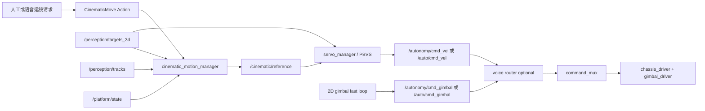

# FCR 四种运镜模式设计与实机使用

## 1. 当前实现

系统新增一个可取消的任务层 `cinematic_motion_manager`，提供：

- `STATIC_TRACK`：底盘保持静止，Sony 二维快环驱动 RS2 云台锁定人物。
- `DOLLY_IN_OUT`：PBVS 根据三维距离闭环前进或后退到指定距离。
- `TRUCK_LEFT_RIGHT`：底盘横移指定距离，云台快环持续保持人物构图。
- `ORBIT_ARC`：以目标为圆心，在指定半径上完成限定角度圆弧运动。

运镜采用“两级状态机”：先通过 `/cinematic/enter` 进入运镜待命，再通过
`/cinematic/execute` 执行一个动作。`/cinematic/stop` 只停止当前动作并返回
运镜待命，`/cinematic/exit` 才会退出运镜并进入待机。任务管理器只发布
`/cinematic/reference` 和模式请求，不会直接发布底盘或云台命令。



因此仍满足两条控制纪律：`command_mux` 是最终执行命令的唯一所有者；运镜
任务不能绕过 PBVS 深度质量门控、平台在线状态、急停和速度限幅。

## 2. 两级状态机与安全行为

顶层状态为：

```text
STANDBY ── /cinematic/enter ──> CINEMATIC
CINEMATIC ── /cinematic/exit ──> STANDBY
```

运镜模式内部状态为：

```text
READY ── Action goal ──> EXECUTING ── 完成/停止/失败 ──> READY
```

- `STANDBY` 可以接受普通跟随或进入运镜指令，但不接受运镜 Action。
- 进入 `CINEMATIC/READY` 后，普通底盘跟随被锁止，感知和目标跟踪继续运行。
- 一个动作结束后仍处于 `CINEMATIC/READY`，可以连续执行下一个动作。
- 只有 `/cinematic/exit` 会释放运镜参考、切换到手动并进入待机；不会自动恢复跟随。
- `/cinematic/status` 使用可靠、Transient Local QoS 发布当前顶层模式、动作状态、动作类型和目标 ID。

单个任务内部状态为：`ACQUIRE → ALIGN → EXECUTE → HOLD`。短时漏检进入
`RECOVER`，恢复同一 tracking ID 后继续；超过超时则中止。

- 动态模式必须有可信的真实/降级三维测量，预测深度不得授权平移。
- 目标丢失、深度失效、底盘离线、平台状态过期或急停时立即发布零参考。
- 每次任务锁定一个 tracking ID，不因画面中新出现人物自动换人。
- 横移和环绕使用加减速曲线，接近终点时提前制动。
- 每个 Action 的 `max_speed` 会限制 PBVS 反馈与运镜前馈合成后的平移速度，
  Dolly、Truck、Orbit 均不会绕过该任务上限。
- 参考超过 `0.20 s` 未更新时，`servo_manager` 不会继续复用旧前馈速度。
- `STATIC_TRACK` 运行期间会清零完整底盘 Twist，仅保留独立二维云台快环。

## 3. 构建与启动

Jetson 拉取代码后重新生成接口并编译相关包：

```bash
cd ~/ros2_ws
source /opt/ros/humble/setup.bash

colcon build \
  --symlink-install \
  --packages-up-to vision_servo_msgs servo_control_pkg external_control_pkg bringup_pkg \
  --cmake-args -DCMAKE_BUILD_TYPE=Release

source ~/ros2_ws/install/setup.bash
```

完整 PBVS、二维云台快环、深度融合和运镜任务一键启动：

```bash
ros2 run bringup_pkg start_fcr.sh --controller pbvs
```

启动脚本仍以 `MANUAL/STANDBY` 启动。确认人员和安全空间后，先进入运镜模式：

```bash
ros2 service call /cinematic/enter std_srvs/srv/Trigger "{}"
```

确认已进入运镜待命：

```bash
ros2 topic echo /cinematic/status --once --qos-durability transient_local
ros2 topic echo /remote_control/status --once --full-length
```

应分别看到 `mode=CINEMATIC, action_state=READY` 和 `mode=auto`。

## 4. 四种任务命令

下列示例均自动采用当前 `tracking_id`（`tracking_id: -1`）。第一次测试应把
速度限制在 `0.05 m/s`，确认方向后再逐步升高。

### 4.1 STATIC_TRACK

保持 60 秒，底盘完全不动：

```bash
ros2 action send_goal --feedback \
  /cinematic/execute vision_servo_msgs/action/CinematicMove \
  "{mode: 0, tracking_id: -1, target_distance_m: 0.0, displacement_m: 0.0, orbit_angle_deg: 0.0, orbit_radius_m: 0.0, max_speed: 0.0, duration_sec: 60.0, direction: 0}"
```

### 4.2 DOLLY_IN_OUT

移动到人物前方 `1.5 m`；当前距离大于 1.5 m 时前进，小于 1.5 m 时后退：

```bash
ros2 action send_goal --feedback \
  /cinematic/execute vision_servo_msgs/action/CinematicMove \
  "{mode: 1, tracking_id: -1, target_distance_m: 1.5, displacement_m: 0.0, orbit_angle_deg: 0.0, orbit_radius_m: 0.0, max_speed: 0.05, duration_sec: 20.0, direction: 0}"
```

### 4.3 TRUCK_LEFT_RIGHT

向机器人左侧横移 `0.5 m`：

```bash
ros2 action send_goal --feedback \
  /cinematic/execute vision_servo_msgs/action/CinematicMove \
  "{mode: 2, tracking_id: -1, target_distance_m: 2.0, displacement_m: 0.5, orbit_angle_deg: 0.0, orbit_radius_m: 0.0, max_speed: 0.05, duration_sec: 20.0, direction: 1}"
```

向右横移时使用 `displacement_m: -0.5, direction: -1`。

### 4.4 ORBIT_ARC

以 `2.0 m` 半径向左完成 30° 环绕：

```bash
ros2 action send_goal --feedback \
  /cinematic/execute vision_servo_msgs/action/CinematicMove \
  "{mode: 3, tracking_id: -1, target_distance_m: 0.0, displacement_m: 0.0, orbit_angle_deg: 30.0, orbit_radius_m: 2.0, max_speed: 0.05, duration_sec: 30.0, direction: 1}"
```

向右环绕使用 `direction: -1`。30° 验证通过后，再依次测试 60° 和 90°。

## 5. 随时停止与回到遥控

停止当前运镜任务，但保留运镜模式：

```bash
ros2 service call /cinematic/stop std_srvs/srv/Trigger "{}"
```

退出运镜模式并进入待机：

```bash
ros2 service call /cinematic/exit std_srvs/srv/Trigger "{}"
```

退出后不会自动恢复 PBVS 跟随。需要跟随时，再使用项目既有的“开始跟随”
指令显式进入跟随模式。

紧急情况下应优先使用项目既有急停，而不是等待 Action 正常结束。

## 6. 语音接口

启用语音链路时，动作仍统一进入同一个 Action 管理器。运镜语音协议需要
遵循相同的两级语义：先进入运镜模式，再发送具体动作；动作结束后不自动
退出运镜模式。

- `start_dolly`：使用语音消息中的距离；未指定时默认 `1.5 m`。
- `start_orbit`：默认半径 `2.0 m`、左向 30°。
- `stop_cinematic` / 已路由的 `stop_current_action`：只取消活动任务并返回 READY。
- “退出运镜”：调用 `/cinematic/exit`，回到 STANDBY。
- `start_following`：必须在退出运镜后由跟随模式管理器显式接受。
- `query_camera_motion_status`：在 Jetson 日志中输出任务状态。

语音桥只读取经过分类和门控的 `intents`，不会从 ASR 原文猜测硬件动作。

## 7. 首轮验收顺序

1. 架空底盘验证节点唯一性、进入/退出运镜及停止服务。
2. 落地测试 `STATIC_TRACK`，确认 `/cmd_vel` 始终为零。
3. 以 `0.05 m/s` 测试 Dolly 前后两个方向。
4. 以 `0.05 m/s` 测试 Truck 左右各 `0.3–0.5 m`。
5. 清空半径 3 m 的安全区域，依次测试 Orbit 30°、60°、90°。
6. 每种模式分别遮挡目标、断开深度、切回手动，确认立即停车且不换 ID。

首轮测试前不要提高 `cinematic_params.yaml` 中的速度和加速度。
