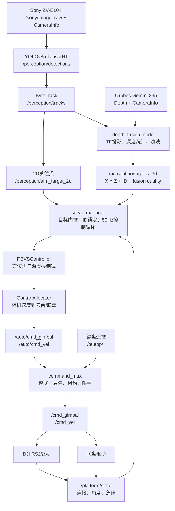
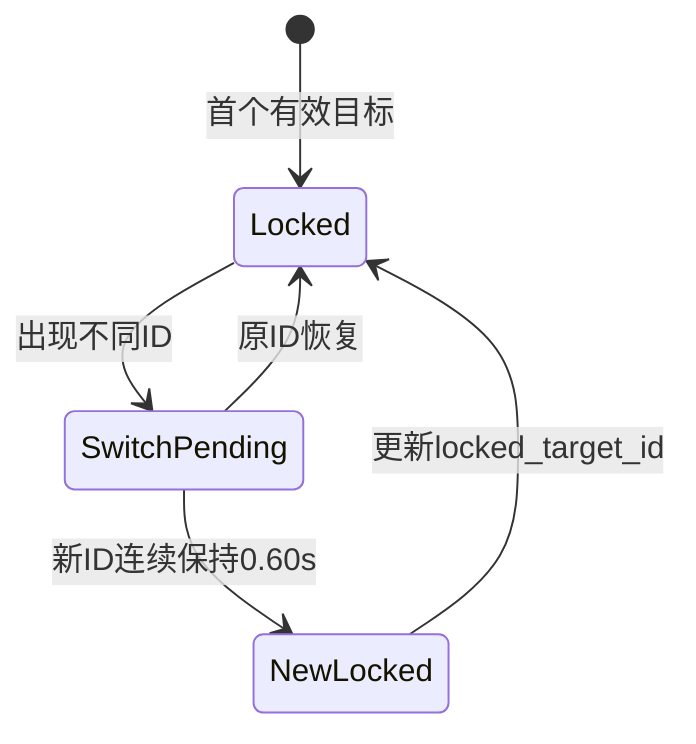
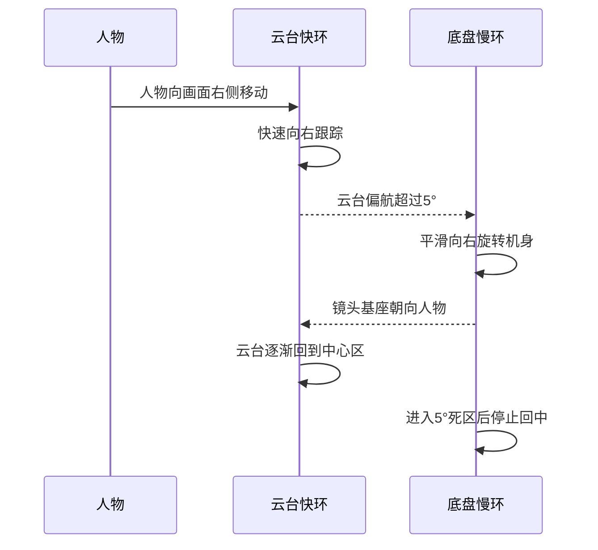
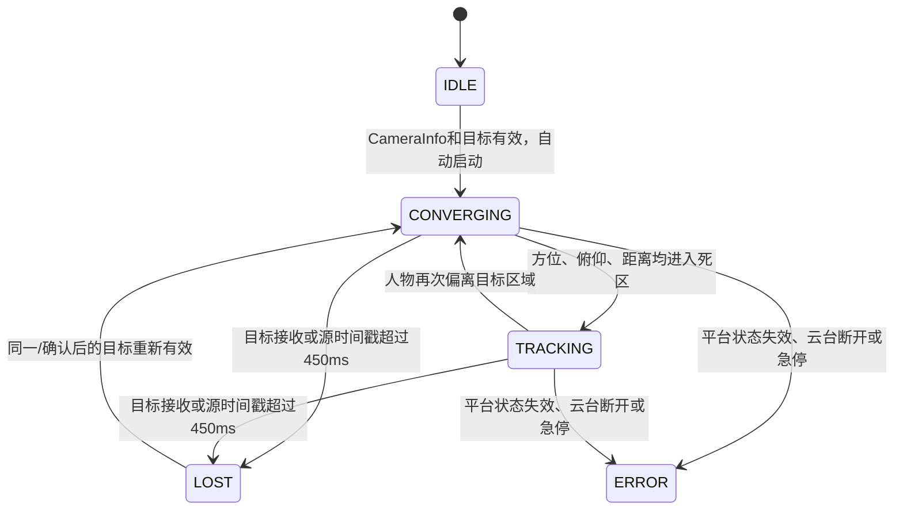
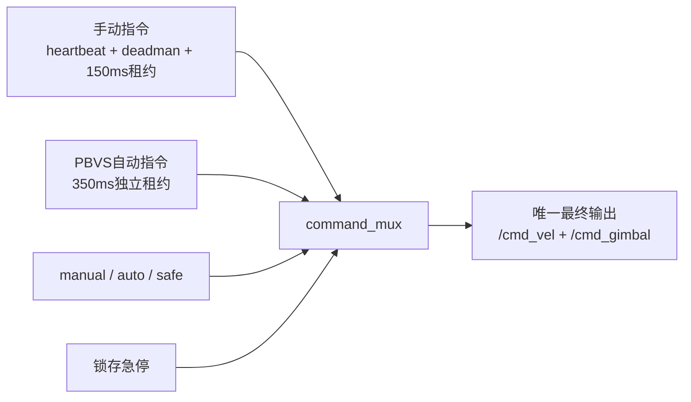

# PBVS视觉伺服控制技术设计

> 适用实现：FCR ROS 2 Humble 当前实机链路  
> 控制器插件：`servo_control_pkg::PBVSController`  
> 当前参数基线：提交 `72c918d`（v3.3.27）

## 1. 设计目标

本系统面向“Sony相机安装在DJI RS2云台上、云台安装在移动底盘上”的人物跟拍
场景。控制目标是：

1. 使用云台快速消除人物在画面中的水平和垂直偏差；
2. 使用底盘保持人物与相机的期望距离；
3. 使用底盘慢速消除云台长期偏航，避免云台逼近机械限位；
4. 深度短时退化时允许镜头继续有限预测，但禁止不可信深度驱动底盘；
5. 感知、硬件或通信异常时进入可解释的安全状态；
6. 手动遥控和自动跟随共享唯一最终指令入口。

当前PBVS不是刚体六自由度位姿控制。人物检测无法可靠观测刚体姿态，因此控制器
把人物建模为Sony光学坐标系中的三维点，并独立控制：

- 水平方位角；
- 垂直方位角；
- 前向深度。

## 2. 系统结构



### 2.1 软件职责边界

| 模块 | 职责 | 不负责 |
| --- | --- | --- |
| `depth_fusion_node` | 产生带质量信息的3D人物点 | 不直接控制执行器 |
| `face_aim/aim_target`链路 | 给出高频2D构图关注点 | 不决定底盘距离 |
| `servo_manager` | 门控、目标锁定、调度、状态发布 | 不实现具体PBVS公式 |
| `PBVSController` | 从三维点计算相机期望速度 | 不知道CAN和电机协议 |
| `ControlAllocator` | 把相机速度分给云台和底盘 | 不选择目标 |
| `command_mux` | 手动/自动仲裁和最终安全限幅 | 不修改视觉目标 |
| 硬件驱动 | 执行最终命令、报告连接状态 | 不自行选择控制模式 |

## 3. 接口定义

### 3.1 输入

| 话题 | 类型 | 关键字段 | 用途 |
| --- | --- | --- | --- |
| `/perception/targets_3d` | `TargetArray` | `tracking_id`, `position`, `fusion_state`, `fusion_age`, `depth_confidence` | 三维方位、距离、目标身份 |
| `/perception/aim_target_2d` | `AimTarget2D` | `tracking_id`, `pixel_x/y`, `source`, `confidence`, `valid` | 高频人脸/上身构图点 |
| `/sony/camera_info` | `sensor_msgs/CameraInfo` | `fx, fy, cx, cy, width, height` | 像素反投影 |
| `/platform/state` | `PlatformState` | 云台角度、底盘/云台连接、急停 | 控制分配和安全门控 |

### 3.2 自动控制输出

| 话题 | 类型 | 说明 |
| --- | --- | --- |
| `/auto/cmd_vel` | `geometry_msgs/TwistStamped` | PBVS底盘候选指令 |
| `/auto/cmd_gimbal` | `GimbalCmd` | PBVS云台候选指令 |
| `/servo/state` | `ServoState` | 状态、误差、相机速度、分配结果 |

### 3.3 最终执行输出

`command_mux`根据当前模式输出：

| 话题 | 来源 |
| --- | --- |
| `/cmd_vel` | 自动PBVS或手动遥控二选一 |
| `/cmd_gimbal` | 自动PBVS或手动遥控二选一 |

任何节点都不应绕过 `command_mux` 成为第二个最终指令发布者。

## 4. 坐标系

Sony光学坐标系采用ROS光学约定：

```text
X：图像右方
Y：图像下方
Z：镜头前方
```

底盘 `base_link`：

```text
X：车体前方
Y：车体左方
Z：车体上方
```

目标三维位置记为：

\[
\mathbf{p}_c =
\begin{bmatrix}
X & Y & Z
\end{bmatrix}^{T}
\]

其中位置必须位于 `sony_camera_optical_frame`。PBVS拒绝frame不匹配的目标，避免
把其他坐标系下的数值直接当成相机坐标。

## 5. 目标选择与身份锁定

### 5.1 选择顺序

1. 如果 `TargetArray.tracking_id >= 0`，只查找该ID；
2. 如果没有指定ID，选择第一个可执行目标；
3. 找不到目标时不刷新安全超时；
4. 目标必须通过PBVS角度质量门控后才能进入控制器。

### 5.2 ID切换滞回

PBVS维护：

```text
locked_target_id
pending_target_id
pending_target_since
```

当观测ID与锁定ID不一致时：



新ID必须持续存在 `0.60 s` 才正式切换。切换时清空旧ID的可信深度缓存，防止把
旧人的距离用于新目标。

这是一种身份切换滞回，不是ReID。长时间离开画面后重新出现仍不能保证恢复原ID。

## 6. 输入质量与时间门控

系统把“允许转动镜头”和“允许驱动底盘平移”分成两个权限等级。

### 6.1 角度目标

角度环接受：

- `VALID`：目标可见、跟踪状态为 `CONFIRMED`；
- `DEGRADED`：目标可见、跟踪状态为 `CONFIRMED`；
- `PREDICTED`：仅限当前目标短时预测，状态可为 `CONFIRMED` 或 `LOST`。

共同要求：

- 三维位置有限且 `Z > 0`；
- 深度置信度、融合年龄为有限值；
- `VALID/DEGRADED` 的置信度不低于 `0.40`；
- `PREDICTED` 的预测年龄不超过 `0.30 s`。

### 6.2 平移目标

底盘平移只接受：

```text
visible
AND tracking_state == CONFIRMED
AND fusion_state == VALID
AND depth_confidence >= 0.65
AND 0 <= fusion_age <= 0.20s
AND Z > 0
```

因此预测值可以短时维持镜头方向，但不能直接驱动底盘接近人物。

### 6.3 可信深度保持

当当前融合状态暂时不能用于平移，但同一ID最近有可信Z时：

\[
Z_{control} = Z_{last\_valid}
\]

最长保持：

```yaml
pbvs_translation_hold_timeout: 0.35
```

预测或降级目标不会刷新这份缓存，避免预测链无限延长平移权限。

### 6.4 整体目标超时

控制循环同时检查：

- 最后一次有效目标的接收时间；
- 目标消息自身的源时间戳。

两者当前上限均为 `0.45 s`。超过门限：

- 发布底盘零速；
- 云台进入 `hold_yaw/hold_pitch`；
- `/servo/state` 发布 `LOST`。

450ms来自实机rosbag基线：融合目标P99到达间隔约402ms。它用于容忍短时调度和
USB抖动，不代表系统允许长期盲目预测。

## 7. 2D关注点与3D距离组合

PBVS优先使用高频 `/perception/aim_target_2d` 控制构图，同时保留融合节点测得的
真实深度Z。

二维关注点只有满足以下条件才生效：

- `valid == true`；
- ID等于 `locked_target_id`；
- frame正确；
- 收到时间和源时间均不超过 `0.18 s`；
- 像素坐标位于图像范围内。

利用相机内参反投影：

\[
X = \frac{u-c_x}{f_x}Z
\]

\[
Y = \frac{v-c_y}{f_y}Z
\]

其中：

- \(u,v\)：人脸、关键点或上半身关注点；
- \(f_x,f_y,c_x,c_y\)：Sony相机内参；
- \(Z\)：融合深度或同一ID短时保持的可信深度。

这样形成两层感知：

```text
高频2D关注点 → 决定镜头瞄准哪里
可信3D深度   → 决定底盘离人物多远
```

如果2D关注点无效，控制器回退到 `/perception/targets_3d` 自带的X、Y。

## 8. PBVS核心控制算法

### 8.1 可观测控制量

人物只被建模为三维点，不虚构目标姿态。控制器计算三个误差。

水平方位角：

\[
e_{\psi} = \operatorname{atan2}(X,Z)
\]

垂直方位角：

\[
e_{\theta} =
\operatorname{atan2}\left(Y,\sqrt{X^2+Z^2}\right)
\]

距离误差：

\[
e_z = Z-Z_d
\]

当前期望距离：

\[
Z_d = 2.0\ \text{m}
\]

### 8.2 死区函数

三个误差进入带连续边界的死区：

\[
\operatorname{db}(e,d)=
\begin{cases}
0, & |e|\le d\\
e-\operatorname{sign}(e)d, & |e|>d
\end{cases}
\]

当前死区：

| 误差 | 门限 |
| --- | ---: |
| 水平角 | `2°` |
| 俯仰角 | `3°` |
| 深度 | `0.20 m` |

减去死区宽度而不是直接返回原误差，可以避免刚越过边界时产生速度突跳。

### 8.3 误差滤波

俯仰误差：

\[
\bar e_{\theta,k} =
\alpha_{\theta}e_{\theta,k}
+(1-\alpha_{\theta})\bar e_{\theta,k-1}
\]

深度误差：

\[
\bar e_{z,k} =
\alpha_z e_{z,k}
+(1-\alpha_z)\bar e_{z,k-1}
\]

当前：

```text
alpha_pitch = 0.25
alpha_depth = 0.20
```

水平角不做同级低通，由后续云台分配器的输出滤波处理，以保留水平跟踪响应。

### 8.4 比例控制律

PBVS输出相机光学坐标系下的六维速度：

\[
\mathbf{v}_c =
\begin{bmatrix}
v_x & v_y & v_z & \omega_x & \omega_y & \omega_z
\end{bmatrix}^{T}
\]

当前启用分量：

\[
v_z = k_z\operatorname{db}(\bar e_z,d_z)
\]

\[
\omega_x = k_{\theta}\operatorname{db}(\bar e_{\theta},d_{\theta})
\]

\[
\omega_y = -k_{\psi}\operatorname{db}(e_{\psi},d_{\psi})
\]

横向平移默认关闭：

\[
v_x = 0
\]

其他不可执行或不需要的分量：

\[
v_y = 0,\quad \omega_z=0
\]

当前增益：

| 参数 | 值 |
| --- | ---: |
| \(k_z\) `translational_gain` | `0.55` |
| \(k_\psi\) `rotational_gain` | `0.85` |
| \(k_\theta\) `pitch_gain` | `0.45` |

速度限幅：

```text
|linear| <= 0.08 m/s
|angular| <= 0.50 rad/s
```

### 8.5 加速度限制

相机观测是离散样本，而控制循环运行在50Hz。为避免新观测造成速度阶跃：

\[
v_{z,k} =
\operatorname{clip}
\left(
v_{z,k}^{raw},
v_{z,k-1}-a_v\Delta t,
v_{z,k-1}+a_v\Delta t
\right)
\]

\[
\omega_{x,k} =
\operatorname{clip}
\left(
\omega_{x,k}^{raw},
\omega_{x,k-1}-a_p\Delta t,
\omega_{x,k-1}+a_p\Delta t
\right)
\]

当前：

```text
a_v = 0.20 m/s²
a_pitch = 0.60 rad/s²
dt限制在[0.001, 0.10]秒
```

### 8.6 收敛判定

只有三个条件同时满足才判定 `TRACKING`：

\[
|e_\psi|\le d_\psi
\land |e_\theta|\le d_\theta
\land |e_z|\le d_z
\]

此时六维相机速度全部置零。

注意：`TRACKING` 在该消息中表示“已经进入误差容许范围”，而不是泛指“当前仍能
看到目标”。尚在追赶目标时状态是 `CONVERGING`。

## 9. 相机速度到执行器的分配

### 9.1 平移坐标变换

相机Z轴是镜头前方。相机固定在云台上，因此镜头前方可能与底盘前方不同。

先进行中性安装映射：

\[
v_{forward}^{0}=v_z
\]

\[
v_{lateral}^{0}=-v_x
\]

再按当前云台偏航与安装偏角旋转到 `base_link`：

\[
\begin{bmatrix}
v_{base,x}\\
v_{base,y}
\end{bmatrix}
=
\begin{bmatrix}
\cos\gamma & -\sin\gamma\\
\sin\gamma & \cos\gamma
\end{bmatrix}
\begin{bmatrix}
v_{forward}^{0}\\
v_{lateral}^{0}
\end{bmatrix}
\]

\[
\gamma = yaw_{gimbal}+yaw_{mount}
\]

当前：

```text
camera_mount_yaw_offset_rad = 0
chassis_linear_sign = +1
enable_lateral_translation = false
```

### 9.2 云台映射

光学坐标系与RS2物理方向的映射：

\[
\dot\psi_{gimbal}=-\omega_y
\]

\[
\dot\theta_{gimbal}=-\omega_x
\]

因此：

- 人物在画面右侧 \(X>0\)：云台向右；
- 人物在画面下方 \(Y>0\)：云台向下；
- 人物距离过远 \(Z>Z_d\)：底盘前进；
- 人物距离过近 \(Z<Z_d\)：底盘后退。

### 9.3 快慢级联

PBVS一键启动时：

```text
allocation_ratio = 0.0
```

正常情况下：

- 水平方位误差优先交给云台快环；
- 底盘不与云台同时按同一方位误差大幅旋转；
- 底盘偏航主要承担云台回中；
- 云台接近限位时，方位控制逐渐转移给底盘。

### 9.4 云台限位分配

定义云台偏航饱和度：

\[
s_{\psi}=
\operatorname{clip}
\left(
\frac{|yaw_{gimbal}|}{yaw_{limit}-margin},
0,1
\right)
\]

云台获得的方位比例：

\[
f_{\psi}=(1-r)(1-s_{\psi})
\]

其中 \(r\) 为 `allocation_ratio`。当云台接近限位，\(s_\psi\to1\)，云台方位输出
下降，底盘承担更多旋转。

### 9.5 底盘回中

云台偏航超过5°后才产生回中误差：

\[
e_u =
\begin{cases}
0, & |yaw_g|\le d_u\\
\operatorname{sign}(yaw_g)(|yaw_g|-d_u), & |yaw_g|>d_u
\end{cases}
\]

底盘原始角速度：

\[
\omega_{base}^{raw}
=s_{base}
\left[
\omega_{\psi}
\cdot
\left(r+s_{\psi}(1-r)\right)
+k_u e_u
\right]
\]

当前：

```text
unwind_gain = 0.4
unwind_deadband = 5°
chassis_angular_sign = -1
```

这实现以下协同过程：



### 9.6 输出平滑

底盘偏航先低通：

\[
\omega_k^f =
\alpha_b\omega_k^{raw}
+(1-\alpha_b)\omega_{k-1}^f
\]

再限制角加速度：

\[
|\omega_k^f-\omega_{k-1}^f|
\le a_{\omega}\Delta t
\]

当前：

```text
chassis_yaw_filter_alpha = 0.25
chassis_angular_acceleration_limit = 0.75 rad/s²
```

云台分配结果也进行低通：

\[
u_{g,k} =
\alpha_g u_{g,k}^{raw}
+(1-\alpha_g)u_{g,k-1}
\]

当前 `smoothing_alpha = 0.8`。云台速度绝对值低于 `0.001 rad/s` 时设置hold标志。

## 10. ServoManager控制循环

控制循环默认50Hz，核心伪代码如下：

```text
if CameraInfo无效:
    return

if 没有目标 or 接收时间超时 or 源时间戳超时:
    publish_zero_command()
    state = LOST
    return

if auto_start and 尚未设置目标:
    使用当前3D点和desired_depth初始化PBVS

control_target = 当前锁定3D目标

if 当前Z不满足平移质量:
    尝试使用同一ID最近可信Z（最多0.35s）

if 同一ID的高频2D瞄准点新鲜:
    使用内参和Z重新构造X、Y

camera_velocity = PBVS.computeVelocity(control_target, dt)
allocation = ControlAllocator.allocate(camera_velocity, platform_state, dt)

if 不允许底盘平移 or 没有可信/保持深度:
    allocation.linear_x = 0
    allocation.linear_y = 0

if platform_state过期 or 云台断开 or 急停:
    云台hold
    底盘全部置零
    state = ERROR

if 底盘断开:
    底盘全部置零

publish /auto/cmd_vel
publish /auto/cmd_gimbal
publish /servo/state
```

## 11. 状态机



状态含义：

| 状态 | 含义 | 输出 |
| --- | --- | --- |
| `IDLE` | 未初始化或未设置目标 | 不执行闭环 |
| `CONVERGING` | 目标有效，正在消除误差 | 正常控制 |
| `TRACKING` | 三项误差均进入死区 | 零速度保持 |
| `LOST` | 目标超时或不可用 | 底盘零速、云台hold |
| `ERROR` | 平台连接/急停门控抑制运动 | 所有危险运动清零 |

## 12. 手动与自动仲裁

PBVS只产生候选自动指令。`command_mux`执行最终仲裁：



自动模式短暂收到零速时，仲裁层使用有界减速：

```text
linear auto decel = 0.60 m/s²
yaw auto decel    = 1.20 rad/s²
```

以下情况仍立即停车：

- 软件急停；
- 手动松键/死人的开关失效；
- 模式进入safe stop；
- 自动指令真正超过租约；
- 控制源切换的零输出驻留。

## 13. 当前参数总表

### 13.1 PBVS控制器

| 参数 | 当前值 |
| --- | ---: |
| `desired_depth` | `2.0 m` |
| `translational_gain` | `0.55` |
| `rotational_gain` | `0.85` |
| `pitch_gain` | `0.45` |
| `yaw_deadband_rad` | `0.0349066` |
| `pitch_deadband_rad` | `0.0523599` |
| `depth_deadband_m` | `0.20` |
| `pitch_filter_alpha` | `0.25` |
| `depth_filter_alpha` | `0.20` |
| `pitch_acceleration_limit` | `0.60 rad/s²` |
| `linear_acceleration_limit` | `0.20 m/s²` |
| `max_linear_velocity` | `0.08 m/s` |
| `max_angular_velocity` | `0.50 rad/s` |
| `enable_lateral_translation` | `false` |

### 13.2 目标门控

| 参数 | 当前值 |
| --- | ---: |
| `pbvs_min_depth_confidence` | `0.65` |
| `pbvs_min_degraded_confidence` | `0.40` |
| `pbvs_max_fusion_age` | `0.20 s` |
| `pbvs_max_prediction_age` | `0.30 s` |
| `pbvs_max_source_age` | `0.45 s` |
| `target_timeout` | `0.45 s` |
| `pbvs_translation_hold_timeout` | `0.35 s` |
| `pbvs_target_switch_confirmation` | `0.60 s` |
| `aim_target_timeout` | `0.18 s` |
| `platform_state_timeout` | `0.25 s` |

### 13.3 控制分配

| 参数 | 当前值 |
| --- | ---: |
| PBVS启动时 `allocation_ratio` | `0.0` |
| `unwind_gain` | `0.4` |
| `unwind_deadband_rad` | `0.0872665` |
| `chassis_yaw_filter_alpha` | `0.25` |
| `chassis_angular_acceleration_limit` | `0.75 rad/s²` |
| `smoothing_alpha` | `0.8` |
| `chassis_linear_sign` | `+1` |
| `chassis_angular_sign` | `-1` |
| `camera_mount_yaw_offset_rad` | `0.0` |

## 14. 启动逻辑

推荐入口：

```bash
ros2 run bringup_pkg start_fcr_ibvs.sh \
  --controller pbvs
```

脚本在PBVS模式下固定：

```text
controller_plugin = servo_control_pkg::PBVSController
servo_auto_start = true
servo_target_topic = /perception/targets_3d
servo_aim_target_topic = /perception/aim_target_2d
allocation_ratio = 0.0
allow_chassis_translation = true
command_mux初始模式 = manual
```

启动完成后仍需显式切换到自动模式：

```bash
ros2 topic pub --once \
  /teleop/mode \
  std_msgs/msg/String \
  "{data: auto}"
```

## 15. 运行观测

### 15.1 必查话题

```bash
ros2 topic echo /perception/targets_3d --once
ros2 topic echo /perception/aim_target_2d --once
ros2 topic echo /servo/state --once
ros2 topic echo /auto/cmd_vel --once
ros2 topic echo /auto/cmd_gimbal --once
ros2 topic echo /remote_control/status --once
ros2 topic echo /platform/state --once
ros2 topic echo /gimbal/status --once
```

### 15.2 正常链路特征

- `/targets_3d` 中锁定人物有有限X/Y/Z；
- `tracking_id` 与 `/aim_target_2d.tracking_id` 一致；
- `servo/state` 在 `CONVERGING` 和 `TRACKING` 间合理切换；
- `/auto/cmd_*` 有控制输出；
- `remote_control/status` 为 `mode=auto, active_source=auto`；
- `/cmd_*` 只有 `command_mux` 一个发布者；
- `platform/state` 报告云台和底盘已连接；
- 真正丢失目标后约450ms进入 `LOST` 并停车。

## 16. 安全约束与已知边界

1. 当前PBVS控制的是人物三维点，不控制目标姿态；
2. 没有ReID时，长时间离屏或大面积遮挡可能更换ID；
3. 预测状态只能用于短时角度环，不能获得无限平移授权；
4. 450ms是有限容错，不是继续盲走的预测窗口；
5. 云台状态失效时底盘也停止，因为相机朝向不可确认；
6. `TRACKING` 表示误差已进入死区，不表示检测器状态名；
7. 当前横向平移关闭，底盘只进行前后和偏航协同；
8. 软件急停不能替代物理断电急停；
9. 改变相机安装方向后必须重新标定坐标映射和控制符号；
10. 修改控制参数前应保存参数dump与同场景rosbag，逐层对照验证。

## 17. 源码索引

| 文件 | 内容 |
| --- | --- |
| `src/servo_control_pkg/src/pbvs_controller.cpp` | PBVS误差、控制律、死区、滤波、限幅 |
| `src/servo_control_pkg/include/servo_control_pkg/target_input.hpp` | 目标质量门控和选择 |
| `src/servo_control_pkg/src/servo_manager_node.cpp` | 目标锁定、时间门控、控制循环、安全状态 |
| `src/servo_control_pkg/src/control_allocator.cpp` | 坐标变换、云台/底盘分配和回中 |
| `src/servo_control_pkg/config/pbvs_params.yaml` | PBVS参数 |
| `src/servo_control_pkg/config/allocator_params.yaml` | 分配器参数 |
| `src/teleop_control_pkg/src/command_mux_core.cpp` | 手动/自动仲裁与停车语义 |
| `src/teleop_control_pkg/config/remote_control.yaml` | 仲裁限幅和租约 |
| `src/bringup_pkg/scripts/start_fcr_ibvs.sh` | 实机一键启动和PBVS覆盖参数 |

