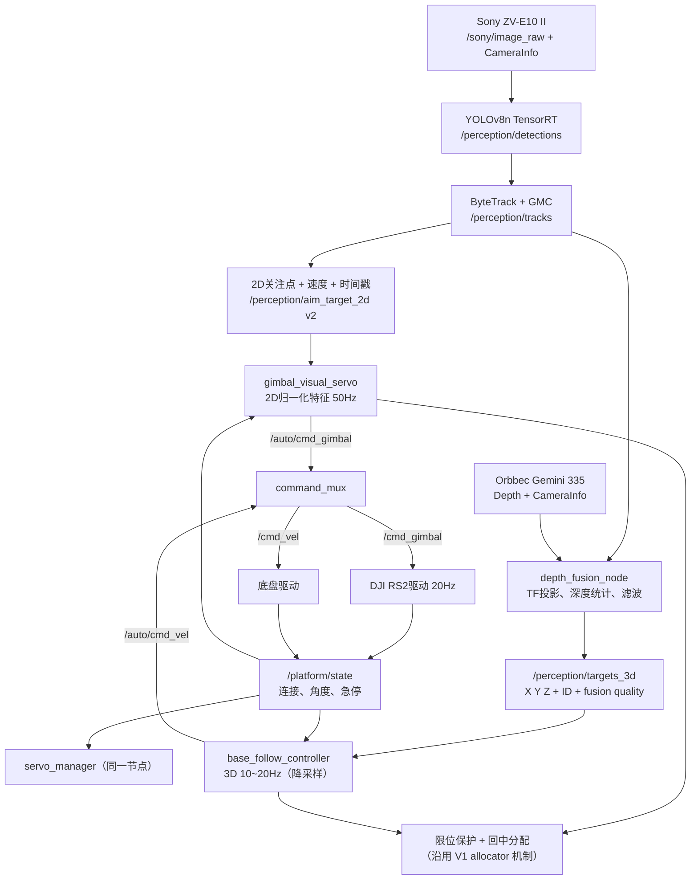
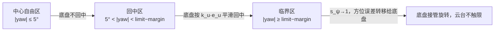

# 伺服控制 V2 设计修正稿：双环拆分与可迁移优化

> 状态：**设计提案，未实现**
> 基线：`v3.3.27` 冻结参数（提交 `72c918d`）与 [`pbvs_servo_control_technical_design.md`](pbvs_servo_control_technical_design.md)（V1）
> 本文档是 V1 的修正稿，吸收 ViSP 视觉伺服库调研的可迁移思想，并修正了初稿中的数学错误。
> 修正过程与依据见 §11（修正记录）与 §12（ViSP 源码索引）。

## 0. 与 V1 的关系

| 范围 | V1（现状冻结基线） | V2（本文档） |
| --- | --- | --- |
| 角度环 | PBVS 三维点 atan2，主循环整体依赖 targets_3d 新鲜度 | **独立 2D 视觉伺服**，直接使用 Sony 归一化坐标，不依赖深度融合 |
| 底盘环 | PBVS 深度通道 + ControlAllocator 分配 | 独立 3D 慢环（距离 + 回中 + 限位保护） |
| 门控 | 一票否决（targets_3d 超时 → 全停） | **三层时间预算 → 执行器权限分层** |
| 控制律 | 固定增益 + 减法死区 | 保留死区作状态判定；增益先固定，后 A/B 自适应 |
| 深度误差 | 绝对误差 Z−Z_d | A/B：绝对 → 归一化 → log 特征 |
| 切换 | 加速度斜坡（刚性） | 无扰切换指数混合（负责连续性）+ 斜坡（负责硬件安全） |
| 保留不动 | 质量门控、ID 锁定滞回、450ms 超时语义、mux 仲裁、急停、租约 | 同 V1 |

**V1 文档继续作为当前实机冻结基线的记录，不被本文档覆盖。**

## 1. 设计目标（V2）

1. **云台追人**：RS2 yaw/pitch 使用 Sony 2D 关注点做高频视觉伺服，不等待深度配准与三维融合；
2. **底盘追位置**：底盘使用深度融合三维点保持距离、横向位置，并负责云台回中与限位保护；
3. **三层时间预算**：身份层（2.5s）、角度层（0.18s）、平移层（0.45s）各自绑定执行器权限；
4. 人物突然横移时云台立即响应（预测 + 前馈），深度退化时云台仍可跟人，仅禁止底盘平移；
5. 目标切换/恢复过程无扰过渡，不产生速度阶跃；
6. 安全底线与 V1 一致：质量门控、mux 唯一最终发布者、急停语义不变。

## 2. 架构总览



### 2.1 职责边界

| 模块 | 职责 | 不负责 |
| --- | --- | --- |
| `gimbal_visual_servo` | 2D 角度误差 → 云台角速度；预测 + 前馈；fallback 链 | 不决定底盘距离 |
| `base_follow_controller` | 3D 距离/横向 → 底盘速度；回中；限位接管 | 不选择目标、不构图 |
| `servo_manager` | 目标锁定、三层门控、状态发布、急停抑制 | 不实现具体控制律 |
| `command_mux` | 手动/自动仲裁、限幅、租约（同 V1） | 不修改视觉目标 |

两个子控制器**运行在同一 `servo_manager` 节点内**（共享 CameraInfo、平台状态、急停门控、锁粗粒度锁），不拆成独立节点——避免双节点各自维护平台状态与标定状态导致的不一致。底盘环在主循环内按 N 拍降采样运行（默认 3 拍 ≈ 16Hz）。

### 2.2 频率视图（含真实约束）

| 环节 | 频率 | 约束来源 |
| --- | ---: | --- |
| Sony 图像 / aim_target_2d | ~30Hz | 相机帧率 |
| gimbal_visual_servo 控制计算 | 50Hz | 主循环 wall-timer |
| **RS2 速度指令** | **20Hz**（增量位置模式 10Hz） | 驱动层限频，见 §10.2 |
| targets_3d 到达 | 突发 2.5~8Hz（P99 间隔 ~402ms） | 深度融合事件驱动 |
| base_follow_controller | 10~20Hz（降采样） | **命令平滑率，非测量率**；测量不足时保持最近有效目标 |
| command_mux | 50Hz | 同 V1 |

## 3. 三层时间预算与执行器权限（门控核心变更）

V1 的主循环前置检查是**一票否决**：`if (!last_target_ || target_stale_locked(now)) → 全停`。V2 改为分层授权：

| 层 | 数据来源 | 时间预算 | 授权执行器 | 超时行为 |
| --- | --- | --- | --- | --- |
| 身份层 | tracks / tracking_id | 2.5s（ByteTrack Lost 删除） | 身份状态、ID 锁定 | 进入搜索/重捕获 |
| 角度层 | aim_target_2d | 0.18s（接收 + 源时间戳双查） | 云台 yaw/pitch | 云台 hold |
| 平移层 | targets_3d | 0.45s（接收 + 源时间戳双查） | 底盘前后/横向 | 底盘零速 |

```text
角度层新鲜 → gimbal_visual_servo 可运行（不查平移层）
平移层新鲜 → base_follow_controller 可运行（平移质量门控仍生效）
两层均过期 → 云台 hold + 底盘零速 + LOST
```

**关键变化**：目标身份仍由 targets_3d/tracks 的 `tracking_id` 链路决定（target_selector + 0.6s 切换滞回不变），但角度环不再因平移层超时而被连带停止。

### 3.1 平移质量门控（保留 V1，不变）

底盘平移只接受 `visible + CONFIRMED + VALID + depth_confidence≥0.65 + fusion_age≤0.20s + Z>0`；同一 ID 最近可信 Z 可保持 0.35s；PREDICTED 只给角度环、不刷新平移缓存。

## 4. 角度环（gimbal_visual_servo）——核心修正

### 4.1 为什么可以绕开深度融合（Z 约消证明）

V1 中当 2D 关注点新鲜时，servo_manager 用**同一个 Z** 重构 `X=(u−cx)/fx·Z`、`Y=(v−cy)/fy·Z`，再代入 PBVS 角度公式：

\[
\psi = \operatorname{atan2}(X,Z)
=\operatorname{atan2}\left(\frac{u-c_x}{f_x}Z,\; Z\right)
=\operatorname{atan}\left(\frac{u-c_x}{f_x}\right)
\]

\[
\theta = \operatorname{atan2}\left(Y,\sqrt{X^2+Z^2}\right)
=\operatorname{atan2}\left(\frac{v-c_y}{f_y},\;\sqrt{1+\left(\frac{u-c_x}{f_x}\right)^2}\right)
\]

**Z 在两条角度公式中完全约消**（Z>0）。结论：

- 同一 Z 重构路径下，深度抖动**不会**注入角度环——初稿 §11 修正记录 1 记录了此前的错误判断；
- 角度环真正依赖深度融合的场景只有 **fallback 路径**（直接使用 targets_3d 的 X/Y）与**整体超时门**；
- 因此正确做法不是"用 Z_d 替换实时 Z 反投影"，而是**直接用 Sony 归一化 2D 特征计算角度**，彻底不进深度融合。

### 4.2 误差定义

\[
e_{\psi} = \operatorname{atan}\left(\frac{u-u^*}{f_x}\right)
\]

\[
e_{\theta} = \operatorname{atan2}\left(\frac{v-v^*}{f_y},\;\sqrt{1+\left(\frac{u-u^*}{f_x}\right)^2}\right)
\]

其中 \((u^*,v^*)\) 为图像中心（或期望构图点），\((u,v)\) 为预测后的关注点（§4.3）。小角度近似（误差 <10° 时误差 <0.6%）：

\[
e_{\psi}\approx\frac{u-u^*}{f_x},\qquad e_{\theta}\approx\frac{v-v^*}{f_y}
\]

实现可直接沿用现有 `atan2` 结构（把 `(u−cx)/fx` 视为 x_n、`(v−cy)/fy` 视为 y_n，Z 一律取 1 或直接传归一化坐标），改动集中且可回退。

### 4.3 延迟预测与速度前馈

#### 时间戳贯穿

AimTarget2D v2 消息扩展：

```text
float32 pixel_x / pixel_y          # 现有
float32 pixel_vel_x / pixel_vel_y  # 新增：关注点像素速度（du/dv）
builtin_interfaces/Time capture_stamp  # 新增：Sony 曝光/采集时间
# header.stamp 保留为跟踪/发布时间
```

`face_aim_node` 的固定 LPF（α=0.4）替换为 **α-β 滤波**（或 One Euro Filter）：慢速时抑制抖动、快速时降低滤波强度，且直接输出带速度的状态。ByteTrack 卡尔曼已有像素速度，但未暴露到消息——pixel_vel 由 face_aim 的 α-β 状态输出（不依赖 ByteTrack 内部状态）。

#### 预测

\[
u_{pred}=u+\dot u\,\tau,\qquad v_{pred}=v+\dot v\,\tau
\]

\[
\tau = t_{control}-t_{capture}+\tau_{RS2}
\]

- \(t_{control}-t_{capture}\)：端到端年龄（曝光/采集 → 检测 → 跟踪 → 发布 → 控制计算）；
- \(\tau_{RS2}\)：CAN 发送与 RS2 响应延迟（实测标定，先取 0.05s 量级）。

#### 控制律

\[
\omega_{\psi,g}
=
K_p\, e_{\psi,pred}
+
K_{ff}\,\dot{\psi}_{target}
\]

\[
\omega_{\theta,g}
=
K_p\, e_{\theta,pred}
+
K_{ff}\,\dot{\theta}_{target}
\]

前馈项使用目标角速度（由 pixel_vel 经内参换算），不叠加传统微分项——速度状态已由 α-β 滤波提供，避免双重微分放大噪声。

### 4.4 增益与限幅

- **初始**：沿用固定增益（当前 yaw 0.85 / pitch 0.45），死区仅保留给 TRACKING 状态判定（§4.5）；
- **后续 A/B**：自适应增益（§7）只先对 yaw 通道做 rosbag 回放对比；
- **限幅语义**：V1 中 PBVS `max_angular_velocity=0.5 rad/s` 是相机速度上限，但 **command_mux 对云台指令的 `max_gimbal_yaw_rate=0.25 rad/s` 是真实生效上限**。要提升跟手性必须先做 mux cap 的 A/B（0.25 → 0.4~0.5），单独调 PBVS 限幅无效。所有限幅保留在 mux 层（唯一最终限幅者）。

### 4.5 收敛判定（TRACKING）

保持 V1 语义：三误差同时进入死区 → TRACKING。**死区是状态判定工具，不参与控制律数值**（减法死区在边缘连续、仅斜率不连续，控制律内使用会引入边界反复启停风险）。

### 4.6 云台环 fallback 链

```text
aim_target_2d 新鲜（0.18s，ID 匹配，像素在图像内）
  → 归一化坐标直算角度（主路径）
aim 过期/无效
  → 使用 targets_3d 的 X/Y（此时角度才依赖深度，允许 DEGRADED，禁止 PREDICTED 平移语义）
两者均过期
  → 云台 hold，进入 §9 搜索行为
```

### 4.7 平台状态门控（保留，不因拆分丢失）

平台状态过期 / 云台断开 / 急停 → 云台 hold + 底盘零速（V1 逻辑原样保留）。相机朝向不可确认时底盘运动不安全，此语义不变。

## 5. 底盘环（base_follow_controller）

### 5.1 深度误差：三方案 A/B

| 方案 | 公式 | 期望点附近斜率 | 说明 |
| --- | --- | --- | --- |
| 绝对（V1 现状） | \(e_z=Z-Z_d\) | \(k_z=0.55\) | 远近误差权重不均 |
| 归一化 | \(e_z=(Z-Z_d)/Z_d\) | \(k_z/Z_d\) | 物理意义直观，噪声不随 Z 放大 |
| **log 特征（推荐）** | \(e_z=\log(Z/Z_d)\) | \(k_{\log}/Z_d\) | 相对误差、无量纲 |

**log 特征采用方案 A（直接对数域 P 控制），不是 ViSP 完整交互矩阵伪逆**：

\[
v_z = -\operatorname{sat}\left(k_{\log}\log\frac{Z}{Z_d}\right)
\]

标定关系：期望点附近 \(\log(Z/Z_d)\approx(Z-Z_d)/Z_d\)，故与 V1 斜率一致取：

\[
k_{\log}\approx k_z Z_d = 0.55\times 2.0 = 1.1
\]

方案 B（ViSP 交互矩阵 \(-1/Z\) 伪逆，\(v_z\approx\lambda Z\log(Z/Z_d)\)，\(\lambda\) 与 \(k_z\) 同量级）**不采用**——保留解耦控制，便于与质量门控/限速/状态机结合。

#### 安全约束（新增）

```text
Z_min ≤ Z ≤ Z_max          # 建议 Z_min=0.5m，Z_max=10m
|log 误差| 限幅              # 防止极小 Z 产生极大输出
深度变化率限制               # 融合已有时序跳变拒绝，控制侧再兜底
```

`TRACKING` 状态判定**仍用绝对距离** \( |Z-Z_d|<0.2m \)——状态机物理语义不因控制律改动而改变（log 死区转换后不对称：\(\log(1.8/2)=-0.105\) vs \(\log(2.2/2)=+0.095\)，故状态判定不换）。

### 5.2 底盘偏航：不直接追像素误差（正式化）

| 控制误差 | 执行器 | 数据 |
| --- | --- | --- |
| 图像水平误差 | 云台 yaw | aim_target_2d（高频） |
| 图像垂直误差 | 云台 pitch | aim_target_2d（高频） |
| 人物距离误差 | 底盘前后 | targets_3d（慢环） |
| 人物横向误差 | 底盘横移（默认关闭） | targets_3d（慢环） |
| 云台相对底盘偏航 | 底盘旋转回中 | /platform/state（实时） |

V1 allocator 中 `ω_base = s_base·[ω_ψ·(r+s_ψ(1−r)) + k_u·e_u]` 在 `r=0` 时已近似满足"底盘不追像素误差"（仅限位临界区 s_ψ→1 时方位误差进入底盘）。V2 正式化：**正常区底盘偏航只由回中项 `k_u·e_u` 驱动**，方位误差仅在临界区转移。

### 5.3 三区限位管理（现有机制的形式化）

V1 allocator 的机制已具备三区，V2 予以明确命名并保持连续过渡：



- 回中：\(e_u=\operatorname{sign}(yaw_g)(|yaw_g|-d_u)\)，死区 \(d_u=5°\)，增益 \(k_u=0.4\)；
- 临界区饱和度 \(s_\psi=\operatorname{clip}(|yaw_g|/(yaw_{limit}-margin),0,1)\) **连续**，避免底盘突然启动；
- 云台输出低通 α=0.8、底盘偏航低通 α=0.25 + 角加速度限 0.75 rad/s² 保留。

## 6. 切换与平滑（修正 V1 表述）

### 6.1 两类机制职责分离

| 机制 | 职责 | 触发 |
| --- | --- | --- |
| 无扰切换指数混合 | **切换连续性**（速度不阶跃） | ID 切换确认、LOST→CONVERGING、控制器热切换、手动→自动 |
| 加速度斜坡 | **硬件安全约束**（限加加速度） | 每个控制周期（现有实现） |

两者叠加，职责不混。V1/初稿曾把 ViSP 的 exp 项描述为"继承旧速度"，实际 ViSP 标准 `computeControlLaw(t)` 是从零命令平滑进入任务——见修正记录 4。

### 6.2 无扰切换公式

\[
u(t)=u_{new}(t)+\left[u_{old}-u_{new}(t_0)\right]e^{-\mu(t-t_0)}
\]

- 切换瞬间 \(u(t_0)=u_{old}\)（速度连续）；
- \(t\to\infty\) 时 \(u(t)\to u_{new}(t)\)；
- \(\mu\) 取 2~4（越大过渡越快）；
- 只在 §6.1 的四个事件时重置 \(u_{old}/t_0\)，不持续刷新。

启动/首次锁定仍可用 ViSP 式"从零进入"（\(e^{-\mu t}\) 项），两者语义不同、分别使用。

## 7. 自适应增益（第三阶段 A/B）

ViSP 自适应增益模型：

\[
\lambda(x)=(\lambda_0-\lambda_\infty)e^{-\frac{\lambda'_0}{\lambda_0-\lambda_\infty}x}+\lambda_\infty,\qquad x=\|e\|_\infty
\]

- 误差大 → 增益趋近 \(\lambda_\infty\)（降低控制斜率）；误差小 → 增益升到 \(\lambda_0\)（加速收敛）；
- **不是软饱和**：\(\lambda_\infty>0\) 时大误差输出仍随误差线性增长，速度/加速度限幅必须保留；
- 小误差区增益升高可能放大 bbox 抖动 → 需同时观测小误差区 RMS（见 §10.4 指标）；
- 建议起始参数 \(\lambda(0.85, 0.30, 5)\)，仅 yaw 通道、rosbag 回放 A/B；
- 与现有限幅链（PBVS 限幅 → allocator 低通 → mux 限幅）并存，不替代任何一级。

## 8. 参数总表（V2 草案）

### 8.1 角度环（gimbal_visual_servo）

| 参数 | 初值 | 备注 |
| --- | ---: | --- |
| 误差公式 | 2D 归一化直算（§4.2） | 不反投影深度 |
| \(K_p\) yaw / pitch | 0.85 / 0.45 | 沿用 V1 起点 |
| \(K_{ff}\) | 0.5~1.0（待标定） | 由 pixel_vel 换算 |
| \(\tau_{RS2}\) | 0.05s（待实测） | CAN+RS2 响应 |
| α-β 滤波参数 | 待标定 | 替代固定 LPF α=0.4 |
| 死区（仅状态判定） | yaw 2° / pitch 3° | 先降 pitch 至 2°（A/B） |
| 控制频率 | 50Hz | 受 RS2 驱动 20Hz 约束，见 §10.2 |
| 云台环 fallback | aim → targets_3d | §4.6 |

### 8.2 底盘环（base_follow_controller）

| 参数 | 初值 | 备注 |
| --- | ---: | --- |
| 深度误差 | log(Z/Z_d)，\(k_{\log}=1.1\) | A/B 三方案（§5.1） |
| \(Z_{min}/Z_{max}\) | 0.5m / 10m | 新增安全约束 |
| log 误差限幅 | 待定 | 防止极小 Z 放大 |
| TRACKING 距离判定 | \|Z−Z_d\|<0.2m | 绝对距离，不变 |
| 底盘环频率 | 16Hz（50Hz 3 拍降采样） | 命令平滑率 |
| 回中 | \(d_u=5°\), \(k_u=0.4\) | 沿用 V1 |
| 临界区 | \(margin=15\%\)，\(s_\psi\) 连续 | 沿用 V1 |
| 平移质量门控 | 同 V1（§3.1） | 不变 |

### 8.3 待 A/B 决策项

| 项 | 选项 | 决策依据 |
| --- | --- | --- |
| 深度误差形式 | 绝对 / 归一化 / log | 误差 RMS + 收敛时间 + 近距稳定性 |
| mux 云台 cap | 0.25 → 0.4~0.5 rad/s | 限幅饱和占比（§10.4 指标③） |
| mux 角速度 cap | 0.25 → 0.4 rad/s | 同上 |
| RS2 指令频率 | 20 → 30/40/50 Hz | CAN 队列监控 + 云台振荡 + 电机温度 |
| pitch 死区/低通 | 3°→2°、α 0.25→上调 | 构图点稳定后（α-β 落地后） |

## 9. 目标丢失行为（后续阶段，依赖 ReID）

```text
LOCKED
  ↓ 短时漏检（≤0.45s）
OCCLUDED      云台按最后角速度轨迹短时预测；底盘停止新增平移；不更新身份模板
  ↓ 遮挡继续（≤2.5s）
SEARCHING     云台围绕最后预测方位小范围扫描，优先原运动方向；底盘停止平移
  ↓ 发现候选人（ReID 相似度 + 位置/运动合理性）
REACQUIRE_PENDING  连续验证（建议 ≥3 帧一致）
  ↓ 验证成功
LOCKED
```

- 0~0.45s 与 V1 预测语义衔接（角度环 PREDICTED ≤0.30s 不变，可平滑扩到 0.45s）；
- 2.5s 与 ByteTrack Lost 删除时间一致；
- 确认前不允许底盘平移。

## 10. 实施计划与验证

### 10.1 阶段划分（严格顺序，一次只改一层）

1. **阶段 1**：角度环 2D 直连 + 门控分层（§3、§4.2）——servo_manager 改造，几十行级，可回退；
2. **阶段 2**：AimTarget2D v2（du/dv + capture_stamp）+ face_aim α-β + 预测前馈（§4.3）；
3. **阶段 3**：无扰切换（§6.2）；
4. **阶段 4**：自适应增益 yaw-only A/B（§7）；
5. **阶段 5**：RS2 频率与 mux caps A/B（§8.3，带 CAN 监控）；
6. **阶段 6**：底盘速度包络测试（§10.3，产品决策）；
7. **阶段 7**：ReID 离线评估 → 搜索状态机（§9）。

### 10.2 RS2 频率 A/B 约束（前车之鉴）

V1 故障复盘 4.19 记录：50Hz 持续发送曾耗尽 USB-CAN 发送队列（`No buffer space available`，云台失联）。A/B 必须同步监控 `can_error_count`、`txqueuelen`、`restart-ms`；当前驱动 `incremental_position` 模式下位置目标实际 10Hz（避免 20ms 覆盖未完成动作），**先确认实际运行模式（速度 / 增量位置）再测频率**。

### 10.3 底盘速度包络（产品决策前置）

当前 mux 与 PBVS 双层限幅 0.08 m/s 背后有明确刹车距离计算（0.6 m/s² 下 0.13s 停住）。"位置跟随"是否产品目标需先确认；若确认，测试协议：

```text
空载/带载直线加减速、横移、斜向移动、原地旋转、边移动边旋转、
急停距离、轮子打滑、舵机温度与电流
```

得出 \(v_{safe}, a_{safe}, \omega_{safe}, \alpha_{safe}\) 后，**同时**上调 PBVS 与 mux 两层限幅（单改一层无效）。

### 10.4 验证指标（每阶段基线对照）

```text
误差 RMS / 95% / 99% 分位
首次进入死区时间
死区退出次数（边界反复启停检测）
角速度 / 角加速度峰值
命令饱和占比（mux 限幅截断比例 → 判断瓶颈在 cap 还是滤波）
目标切换冲击（切换瞬间速度阶跃量）
控制数据年龄（端到端 τ 分布）
```

录包集合与参数 dump 流程沿用 V1 §6（`diagnostics/` 目录、`.gitignore`）。

## 11. 修正记录（相对初稿）

| # | 初稿表述 | 修正 | 依据 |
| --- | --- | --- | --- |
| 1 | 深度抖动会经同 Z 反投影注入角度环（建议用 Z_d 替换） | **Z 在 yaw/pitch 公式中约消**，角度环最优方案是直接使用 Sony 2D 特征 | §4.1 推导 |
| 2 | 死区边沿产生 k·(e−d) 速度跳变 | 减法死区边缘连续、仅斜率不连续；风险是边界噪声反复启停 | 代码 `pbvs_controller.cpp` apply_deadband |
| 3 | 自适应增益等效软饱和 | 非饱和；大误差输出仍随误差线性增长，限幅必须保留 | §7 |
| 4 | ViSP exp(−μt) 项"速度从旧值连续过渡" | 标准实现是从零命令平滑进入任务；ID 切换需显式无扰切换公式 | §6 |
| 5 | L⁺ 伪逆"统一量纲" | 伪逆不做语义权重/量纲归一化，需规范化特征 + 显式缩放 | §12 注 |
| 6 | (Z−Z_d)/Z 与 ViSP 深度律等价 | 仅一阶近似；方案 A（log 域 P 控制）与方案 B（交互矩阵伪逆）是两种控制器 | §5.1 |
| 7 | "我们比 ViSP 强"对比 | 框架与应用系统不同抽象层级，改为应用层机制对照 | §0 |

## 12. ViSP 源码索引（可迁移点出处）

| 可迁移点 | ViSP 位置 | 在本文档中的落地 |
| --- | --- | --- |
| 归一化特征避免量纲问题 | `visual_features/src/visual-feature/vpFeaturePoint.cpp`（交互矩阵 2×6） | §4.2 直接 2D 归一化坐标 |
| 深度特征 log(Z/Z*) | `vpFeatureDepth.cpp` L=[0 0 −1/Z −y x 0] | §5.1 log 误差（方案 A） |
| 自适应增益 λ(x) | `vs/src/vpAdaptiveGain.cpp`（λ(x)=a·e^(−bx)+c） | §7 |
| 任务切换速度连续性 | `vs/src/vpServo.cpp` computeControlLaw(t)（e=−λe1+λe1₀·e^(−μt)） | §6 无扰切换（显式公式） |
| EYEINHAND_L_cVe_eJe 模式控制律 | `vpServo.cpp`（J1=L·cVa·aJe，e1=J1⁺·e） | 仅参考，不照搬 L⁺ |
| 伪逆秩判定阈值 | `core` vpMatrix_pseudo_inverse（sv>maxsv·threshold，默认 1e-6） | 不引入；现有限幅链已覆盖 |
| 帧变换每帧刷新 | `servo-pioneer/servoPioneerPoint2DDepth.cpp`（移动平台刷新 cVe/eJe） | 现有 allocator 实时 yaw 旋转等价 |

## 13. 开放问题

1. \(K_{ff}\) 与 \(\tau_{RS2}\) 的实测标定方法（静止目标小幅平移 + 录包比对）；
2. α-β 滤波参数在"快速横移 vs 慢速构图"两种工况下的统一性；
3. 角度环 fallback 到 targets_3d X/Y 时，是否需要把融合质心与 2D 关注点的射线偏差做补偿（基线/外参导致的系统性偏移）；
4. ReID embedding 在 Orin Nano 8GB 的耗时/准确率离线评估（隐私约束）；
5. 底盘速度包络测试的产品决策（构图跟踪 vs 位置跟随）。
